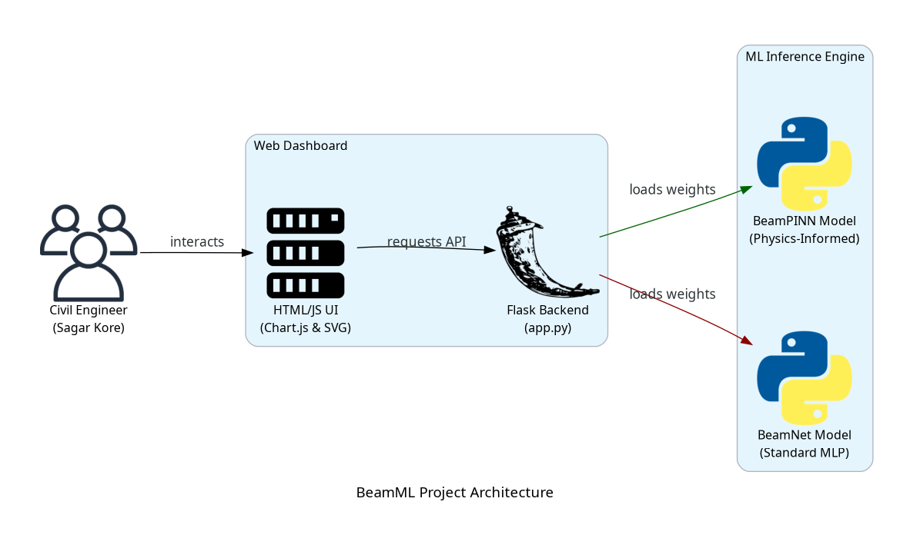
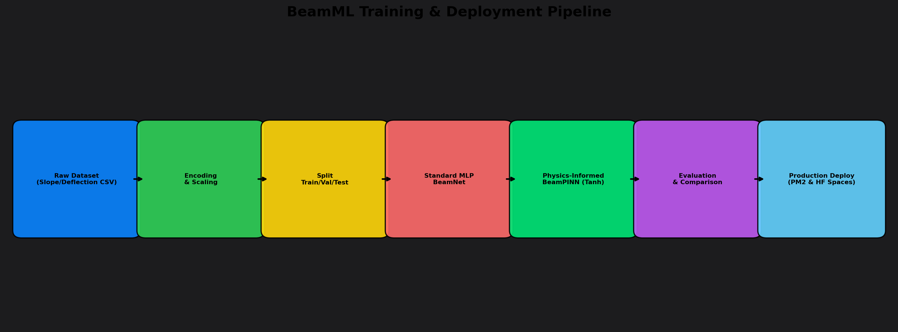
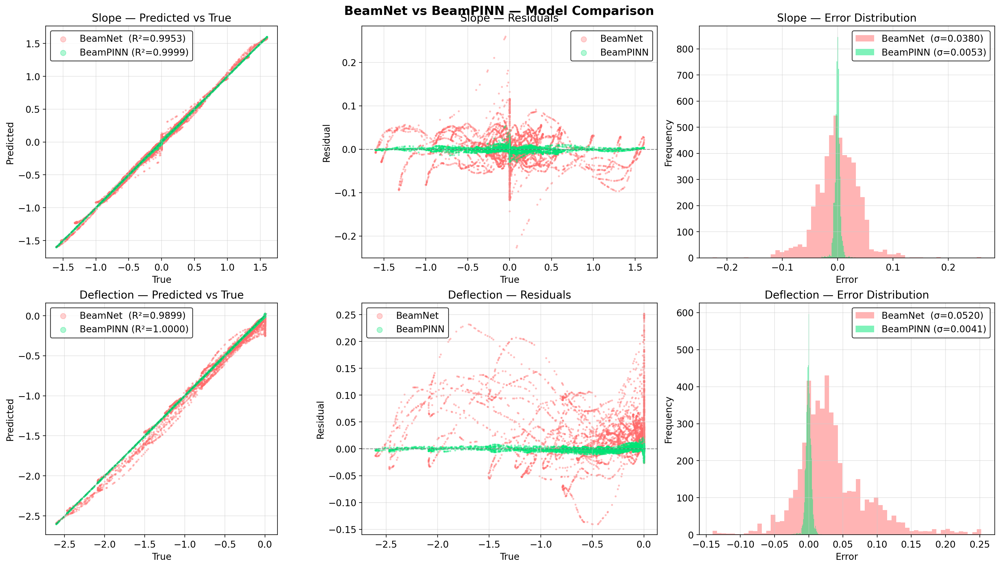

# 🏗️ BeamML: Physics-Informed Neural Networks for Beam Mechanics


BeamML is a machine learning framework designed to predict the structural responses (slope $\theta$ and deflection $w$) of single-span beams under point loads. It benchmarks a standard Multilayer Perceptron (**BeamNet**) against a Physics-Informed Neural Network (**BeamPINN**), demonstrating how integrating physical laws directly into the neural network's loss function leads to massive improvements in accuracy, boundary condition enforcement, and kinematic consistency.

---

## 🚀 Live Demo & Deployment

The application is deployed and available for interactive visualization online:
- **Public URL**: **[Hugging Face Space](https://huggingface.co/spaces/adityashirsatrao007/beam-ml)**
- **Local Dashboard**: `http://localhost:5000` (when running locally)

---

## 📊 System Architecture

The following diagram illustrates the client-server interaction and execution flow of the BeamML dashboard:



---

## ⚙️ ML Pipeline & Training Flow

The ML pipeline handles dataset preparation, scaling, model training under physics regularizers, side-by-side evaluation, and containerized deployment:



---

## ⚡ BeamNet vs. BeamPINN Benchmarks

By enforcing physical laws ($dw/dx = \theta$ and support boundary conditions), **BeamPINN** drastically outperforms the standard MLP network:

| Attribute / Metric | Standard BeamNet (Pure ML) | Physics-Informed BeamPINN | Error Reduction |
| :--- | :---: | :---: | :---: |
| **Slope $R^2$** | 0.9953 | **0.9999** | $+0.46\%$ |
| **Slope MAE** | 0.028321 | **0.003539** | **$-87.5\%$ error** |
| **Deflection $R^2$** | 0.9899 | **1.0000** | $+1.02\%$ |
| **Deflection MAE** | 0.043206 | **0.002963** | **$-93.1\%$ error** |
| **Kinematic Consistency ($|\text{slope} - \frac{dw}{dx}|$)** | 0.086322 | **0.006552** | **$-92.4\%$ error** |

### Comparison Analysis:
Below is the evaluation scatter and error distribution comparisons between both models:



---

## 🛠️ Local Development & Running

### Prerequisites
- Python 3.11+
- Virtual Environment manager (`venv` / `pipx`)

### Installation & Setup

1. **Clone the repository**:
   ```bash
   git clone https://github.com/adityashirsatrao007/beam-ml.git
   cd beam-ml
   ```

2. **Set up virtual environment**:
   ```bash
   python3 -m venv venv
   source venv/bin/activate
   pip install -r requirements.txt
   ```

3. **Train the models**:
   - Train standard BeamNet:
     ```bash
     python3 train.py
     ```
   - Train physics-informed BeamPINN:
     ```bash
     python3 train_pinn.py
     ```

4. **Run comparative evaluation**:
   ```bash
   python3 compare.py
   ```

5. **Start Flask web server**:
   ```bash
   python3 app.py
   ```
   Open your browser to `http://localhost:7860` (or `http://localhost:5000` depending on port bindings).

---

## 📂 Project Structure

```
beam-ml/
├── data/                       # Dataset directory (Slope & Deflection CSVs)
├── docs/
│   ├── images/                 # Exported diagram PNGs & plots
│   └── diagrams/               # Raw diagram source files
├── models/                     # Saved PyTorch weights (.pt) and Scalers (.pkl)
├── outputs/                    # Benchmarking results and loss histories (JSON)
├── templates/                  # Frontend HTML dashboard
├── app.py                      # Flask backend API
├── train.py                    # Standard ML training script
├── train_pinn.py               # PINN training script
├── compare.py                  # Benchmarking & plot generator
├── predict.py                  # CLI inference helper
├── Dockerfile                  # Container configurations
└── requirements.txt            # Dependency configuration
```

---

## 🧠 Physics Constraints Enforced in BeamPINN

1. **Kinematic Consistency Loss**:
   $$\text{Loss}_{\text{kin}} = \text{MSE}\left(\theta(x), \frac{dw(x)}{dx}\right)$$
   Directly computed via PyTorch autograd gradients.
2. **Boundary Conditions (BC) Loss**:
   - Simply Supported (SS): $w(0) = 0$ and $w(L) = 0$.
   - Fixed-Fixed (FF): $w(0) = w(L) = 0$, and $\theta(0) = \theta(L) = 0$.
   - Simply-Fixed (SF): $w(0) = w(L) = 0$ and $\theta(L) = 0$.
3. **Euler-Bernoulli Moment Loss**:
   $$EI \cdot \frac{d^2 w(x)}{dx^2} = M(x)$$
   Enforced as a regularizer on Simply Supported beams.
